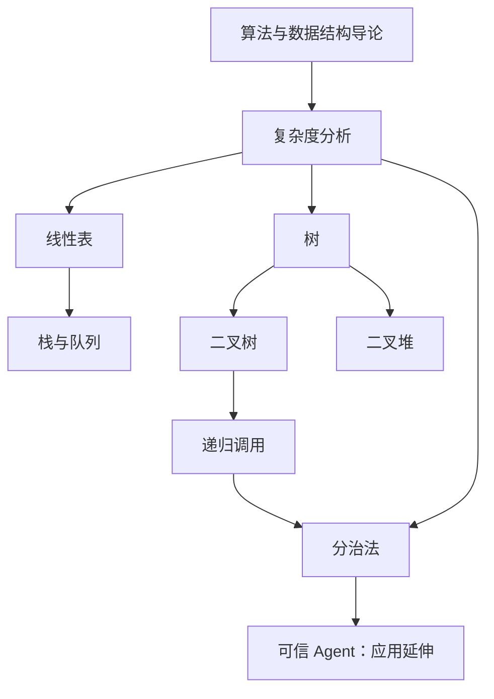

# 算法知识图谱

> [!abstract] 使用方式
> 这是 `algorithm` 文件夹的导航入口，不替代概念笔记。先沿主线学习，再通过每篇笔记底部的“关联”继续展开；复杂度统一作为判断算法是否可行的尺度。

> [!tip] 最短学习路径
> [[导论]] → [[复杂度分析]] → [[线性表]] → [[树]] → [[二叉树]] → [[分治法]]。需要优先队列时，从 [[树]] 转到 [[二叉堆]]；需要讨论 AI 系统可信性时，转到 [[可信agent]]。

## 全局主线

## 概念地图

### 1. 基础视角

- [[导论]]：说明数据结构与算法为何需要一起学习。
- [[复杂度分析]]：用输入规模和增长阶判断时间、空间成本。

### 2. 数据结构

- [[线性表]]：有限序列的上位概念，包含数组、链表、栈和队列。
- [[树]]：非线性结构的导航页。
  - [[二叉树]]：每个节点至多有两个子节点的树。
  - [[二叉堆]]：基于完全二叉树实现优先队列的结构。

### 3. 算法方法

- [[递归调用]]：通过基例和更小规模的同类问题定义计算过程。
- [[分治法]]：分解、递归求解、合并结果；其子问题通常彼此独立。

### 4. 应用延伸

- [[可信agent]]：把算法、知识图谱与可审计的推理流程连接起来；这是应用议题，不是基础数据结构的同层概念。

## 问题导向入口

| 想回答的问题 | 从这里进入 | 下一步 |
| --- | --- | --- |
| 为什么要学习数据结构？ | [[导论]] | [[复杂度分析]] |
| 算法是否能在预期时间内完成？ | [[复杂度分析]] | [[线性表]]、[[树]]、[[分治法]] |
| 如何组织按顺序排列的数据？ | [[线性表]] | [[线性表#栈|栈]]、[[线性表#队列|队列]] |
| 如何表达层级关系？ | [[树]] | [[二叉树]]、[[二叉堆]] |
| 如何把大问题拆成小问题？ | [[递归调用]]、[[分治法]] | 回看 [[复杂度分析]] 中的递推成本 |
| 如何讨论 AI 输出是否可信？ | [[可信agent]] | 回到 [[算法知识图谱]]，区分结构、方法和应用 |

## 复习检查

- [ ] 能区分线性表、树、二叉树和二叉堆的包含关系与用途。
- [ ] 能用 $O(1)$、$O(\log n)$、$O(n)$ 等增长阶描述基本操作。
- [ ] 能说明递归调用的基例、递归步和终止条件。
- [ ] 能说明分治法为什么需要分解、求解和合并三个环节。
- [ ] 能把“算法结构”“复杂度证据”和“应用中的可信性”分开讨论。

## 维护规则

- 新概念先链接到本 MOC，再决定是否单独建笔记。
- 关联优先写成“为什么相关”，避免只堆一组无方向链接。
- 同一概念只保留一个主笔记；需要别名时使用 frontmatter 的 `aliases`。
- 临时内容先放入 [[最大子数组|算法待整理]]，整理完成后再归入对应概念。

## 新建节点

- 概念节点：[[Templates/算法概念节点]]
- 新建主题 MOC：[[Templates/知识图谱 MOC]]

%%
图谱边界：本 MOC 只管理 algorithm 文件夹内的概念关系，不替代 Pattern Recognition 等其他主题图谱。
%%
